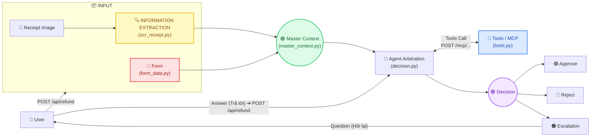

# REFUNDER: Luồng Xử Lý & Đặc Tả Pipeline (Single API: /api/refund)

> **Kiến trúc hệ thống**: Toàn bộ quy trình hoàn ứng được đóng gói trong **1 API duy nhất: `POST /api/refund`**. Bên trong là chuỗi hàm (workflow chaining) liên kết chặt chẽ theo sơ đồ kiến trúc [pipeline.png](file:///workspace/projects/REFUNDER/images/pipeline.png).

---

## 1. Sơ Đồ Kiến Trúc Pipeline (Ánh xạ theo images/pipeline.png)



---

## 2. Chuỗi Hàm Trong Quy Trình (Chaining Workflow)

Toàn bộ quy trình xử lý bên trong `POST /api/refund` được xâu chuỗi tuần tự qua các file độc lập:

| Bước | File Chức Năng | Hàm Thực Thi | Dữ Liệu Đầu Vào (Input) | Dữ Liệu Đầu Ra (Output) |
|---|---|---|---|---|
| **1. Form (🔴)** | `backend/app/form_data.py` | `parse_form_data()` | `raw_form: str \| dict` | `FormData` model |
| **2. Bóc Tách (🟡)** | `backend/app/ocr_receipt.py` | `extract_receipt_info()` | `receipt_file: UploadFile`, `hint: str` | `ExtractedReceipt` model |
| **3. Hợp Nhất (🟢)** | `backend/app/master_context.py` | `build_master_context()` | `form_data`, `extracted_receipt`, `user_answer` | `MasterContext` model |
| **4. Công Cụ (Blue)** | `backend/app/tools.py` | `execute_mcp_tool()` | `tool_name: str`, `arguments: dict` | `ToolCallResponse` model |
| **5. Phán Quyết (🟣)** | `backend/app/decision.py` | `arbitrate_claim()` | `context: MasterContext` | `Decision` model (`Approve` / `Reject` / `Escalation`) |

---

## 3. Đặc Tả Endpoint Duy Nhất: `POST /api/refund`

* **URL**: `POST /api/refund` (hoặc `POST /api/refund/`)
* **Headers**: `multipart/form-data` hoặc `application/json`

### 3.1. Các tham số đầu vào (Input)
* `form_data` (hoặc JSON Body):
  * `employee_id`: Mã nhân viên (ví dụ: `EMP-1001`)
  * `claimed_amount`: Số tiền yêu cầu hoàn ứng (ví dụ: `45.0`)
  * `currency`: Đơn vị tiền tệ (`USD`, `VND`...)
  * `expense_category`: Hạng mục chi phí (`Meals`, `Travel`, `Equipment`...)
  * `description`: Mục đích chi tiêu / giải trình
  * `claim_id` *(tùy chọn)*: Mã hồ sơ cũ nếu đang phản hồi lại câu hỏi Escalation
  * `answer` *(tùy chọn)*: Câu trả lời của User khi giải quyết câu hỏi từ Agent
* `receipt_file` *(tùy chọn)*: File ảnh hoặc PDF của hóa đơn vật lý.

### 3.2. Cấu trúc kết quả trả về (Output)
```json
{
  "claim_id": "CLM-35FA9048",
  "status": "Approve",
  "decision": {
    "status": "Approve",
    "reasoning": "Expense is fully compliant with standard meal and travel allowances.",
    "question": null,
    "policy_reference": "Article 4 & Article 6.1: Standard expense allowances (<= $100/day)",
    "confidence_score": 0.99,
    "claim_id": "CLM-35FA9048"
  },
  "extracted_receipt": {
    "is_readable": true,
    "vendor_name": "Panera Bread / Business Lunch",
    "receipt_date": "2026-09-12",
    "receipt_currency": "USD",
    "total_amount": 45.0,
    "tax_amount": 3.5,
    "tip_amount": 0.0,
    "line_items": [
      { "item": "Roasted Turkey Sandwich", "price": 28.0 },
      { "item": "Sparkling Water & Salad", "price": 13.5 },
      { "item": "Sales Tax", "price": 3.5 }
    ],
    "error_description": null
  },
  "master_context": {
    "user_form": { ... },
    "extracted_receipt": { ... },
    "system_context": { ... },
    "user_answer": null
  }
}
```

---

## 4. Vòng Lặp Phản Hồi (Escalation & User Answer Loop)

1. **Lần 1**: User nộp đơn ➔ Nếu hóa đơn mờ hoặc nghi vấn ➔ Agent trả về `status: "Escalation"` kèm `question: "Hóa đơn mờ, bạn trả bao nhiêu?"`.
2. **Lần 2**: User gửi câu trả lời qua chính `POST /api/refund` (kèm `claim_id` và `answer`) ➔ Agent tiếp nhận câu trả lời ➔ Đổi trạng thái thành `Approve` và hoàn tất quy trình.
