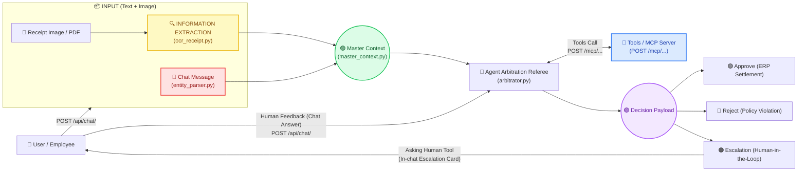

# REFUNDER: Luồng Xử Lý & Đặc Tả Pipeline Chatbot (POST /api/chat/)

> **Kiến trúc hệ thống**: Quy trình hoàn ứng được tương tác qua **Chatbot Interface** thông qua endpoint chính **`POST /api/chat/`** (và hỗ trợ tương thích `POST /api/refund`). Dựa trên sơ đồ kiến trúc [pipeline.png](file:///workspace/projects/REFUNDER/images/pipeline.png) và [agent_pipeline.png](file:///workspace/projects/REFUNDER/images/agent_pipeline.png).

---

## 1. Sơ Đồ Kiến Trúc Pipeline (Ánh xạ chuẩn theo pipeline.png & agent_pipeline.png)



---

## 2. Chuỗi Hàm Trong Quy Trình Chaining Workflow

| Bước | Thành Phần Node | File Phụ Trách | Dữ Liệu Đầu Vào (Input) | Dữ Liệu Đầu Ra (Output) |
|---|---|---|---|---|
| **1. Trích xuất hội thoại (🔴)** | Form Data Payload | `backend/app/extraction/entity_parser.py` | Tin nhắn tự nhiên của user (`message: str`) | `FormData` model (Amount, Category, Description) |
| **2. Bóc tách hóa đơn (🟡)** | Extracted Receipt Payload | `backend/app/extraction/ocr_receipt.py` | Ảnh hóa đơn (`receipt_file: UploadFile`) | `ExtractedReceipt` (Merchant, Total, Items) |
| **3. Tổng hợp bối cảnh (🟢)** | Master Context Payload | `backend/app/context/master_context.py` | `form_data`, `extracted_receipt`, `system_context` | `MasterContext` model |
| **4. Công cụ mở rộng (🔵)** | MCP Tools Server | `backend/app/mcp/tools.py` | Tên tool & tham số (`query`, `amount`) | `ToolCallLog` (`policy_search`, `verify_budget`) |
| **5. Trọng tài phán quyết (🟣)** | Decision Payload | `backend/app/agent/arbitrator.py` | `MasterContext` | `Decision` (`APPROVE`, `REJECT`, `ESCALATE`) |

---

## 3. Đặc Tả Endpoint Chính: `POST /api/chat/`

* **URL**: `POST /api/chat/` (và alias `POST /api/chat`)
* **Content-Type**: `multipart/form-data` hoặc `application/json`

### 3.1. Tham số đầu vào (Input)
* `session_id` *(str, tùy chọn)*: ID phiên hội thoại để duy trì ngữ cảnh nhiều lượt.
* `message` *(str)*: Lời nhắn yêu cầu hoàn ứng từ nhân viên (hoặc câu trả lời giải trình).
* `receipt_file` *(UploadFile, tùy chọn)*: Ảnh chụp hóa đơn hoặc file PDF hóa đơn điện tử.
* `claim_id` *(str, tùy chọn)*: Mã hồ sơ claim đang trong trạng thái `ESCALATE`.
* `action` *(str, mặc định "MESSAGE")*: `"MESSAGE"` hoặc `"RESOLVE_ESCALATION"`.

### 3.2. Cấu trúc kết quả trả về (Output Protocol)
```json
{
  "session_id": "sess_88fa10b2",
  "claim_id": "CLM-35FA9048",
  "reply": "✅ Your refund claim has been verified and APPROVED. All receipt items match policy allowances for business meals (<= $100/day).",
  "step_status": "APPROVED",
  "pipeline_nodes": {
    "form_data": {
      "employee_id": "EMP-1042",
      "claimed_amount": 45.0,
      "currency": "USD",
      "expense_category": "Meals & Entertainment",
      "description": "Standard business lunch with client partner",
      "booking_platform": "Direct Payment"
    },
    "extracted_receipt": {
      "is_readable": true,
      "vendor_name": "Panera Bread",
      "receipt_date": "2026-09-12",
      "receipt_currency": "USD",
      "total_amount": 45.0,
      "tax_amount": 3.5,
      "tip_amount": 0.0,
      "line_items": [
        { "item": "Roasted Turkey Sandwich", "price": 28.0 },
        { "item": "Sparkling Water & Salad", "price": 13.5 },
        { "item": "Sales Tax", "price": 3.5 }
      ]
    },
    "master_context": {
      "user_form": { ... },
      "extracted_receipt": { ... },
      "system_context": {
        "current_date": "2026-09-15",
        "employee_location": "US",
        "manager_id": "MGR-2005",
        "policy_version": "FIN-EXP-001"
      }
    },
    "tool_calls": [
      {
        "tool_name": "policy_search",
        "arguments": { "query": "business lunch allowance" },
        "result": "Article 4: Standard meal rate <= $100/day permitted"
      }
    ],
    "decision": {
      "decision_status": "APPROVE",
      "reasoning_log": "Receipt total matches claimed amount ($45.00). No alcohol items. Within standard allowance limit.",
      "escalation_target": "System Automated (ERP Accounting)",
      "escalation_category": "NONE",
      "escalation_question": null,
      "policy_reference": "Article 4 & Article 6.1: Standard meal allowances",
      "confidence_score": 0.99
    }
  }
}
```

---

## 4. Vòng Lặp Human-in-the-Loop Trực Tiếp Trong Chat

1. **Lần 1 (Gửi yêu cầu & Phát hiện ngoại lệ)**:
   - User nhắn: *"Team dinner with strategic partner client. Invoice is blurry at the bottom."*
   - Chatbot OCR phát hiện hóa đơn bị nhòe mực ➔ Ra quyết định `decision_status = "ESCALATE"`.
   - Trực tiếp render **`EscalationCard`** ngay trong luồng tin nhắn:
     > *"Hóa đơn cho khoản chi bị mờ ở dòng tổng tiền ($450 hay $480). Số tiền thực tế thanh toán trên sao kê thẻ là bao nhiêu?"*

2. **Lần 2 (Nhân viên phản hồi giải trình)**:
   - User chọn gợi ý hoặc gõ: *"Confirm actual total paid is $450.00 (from card statement)"*.
   - Gửi lại qua `POST /api/chat/` với `action="RESOLVE_ESCALATION"`.
   - Agent tiếp nhận lời khai làm bằng chứng bổ sung (Điều 11) ➔ Cập nhật phán quyết thành `APPROVE` ➔ Bắn lệnh thanh toán sang ERP.
